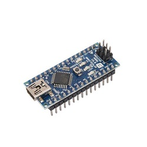
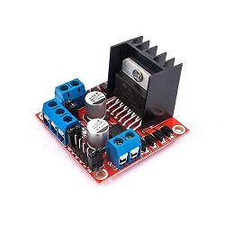

# Self-Balancing-Robot
Side project of self balancing robot that using PID control with Arduino nano and MPU6050.

## Parts
* MPU6050
* Aduino nano
* DC gearbox motor
* L298N (H-bridge)
* 9V Battery

